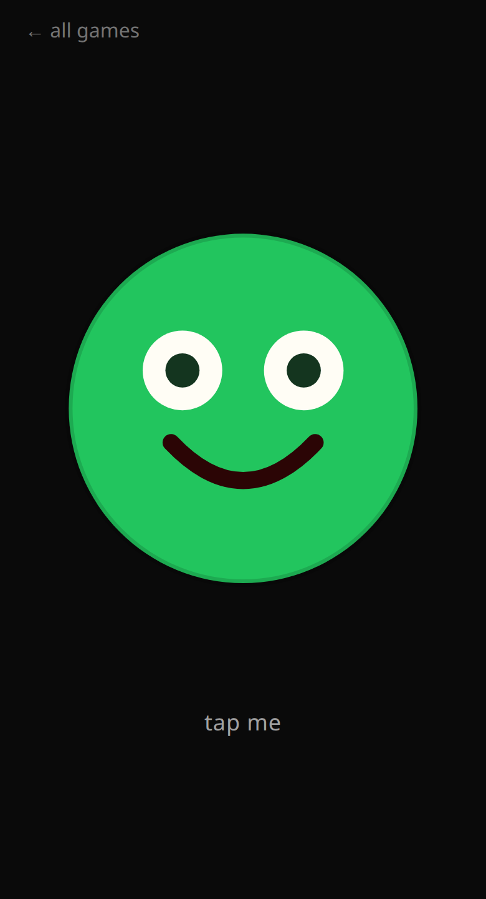
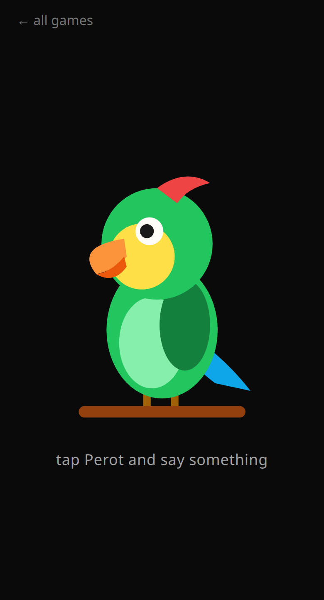
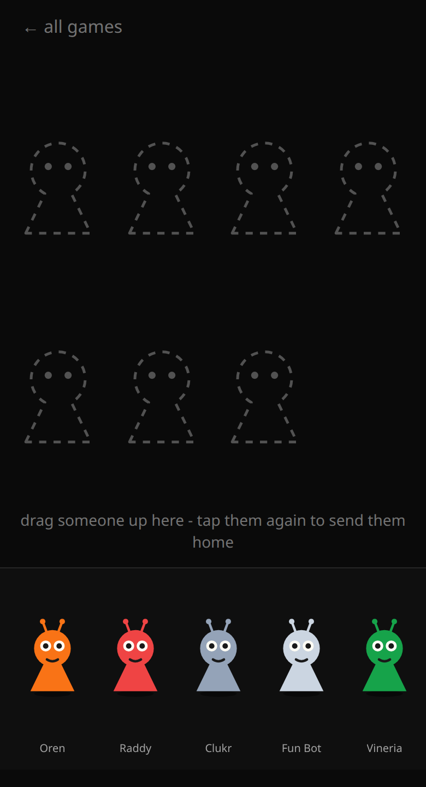
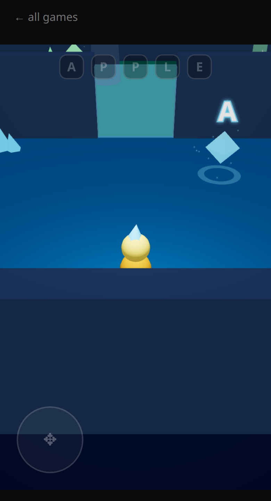

# Alisa's Games


[](https://games.vreshch.com)
[](https://github.com/vreshch/kids-games/actions/workflows/ci.yml)
[](https://github.com/vreshch/kids-games/actions/workflows/deploy.yml)
[](LICENSE)
[](https://claude.com/claude-code)

Little browser games for the phone, invented by **Alisa, age 5**, and built with a little help
from [Claude Code](https://claude.com/claude-code).

**▶ Play at [games.vreshch.com](https://games.vreshch.com)** - no install, no account, no ads.

## What is this?

A 5-year-old cannot type code - but she can draw, talk, and play. That turns out to be enough:

1. Alisa brings the requirements - usually a sketch drawn on paper.
2. She dictates what the game should do to Claude Code through the microphone.
3. Claude Code builds it; dad reviews the pull request and merges.
4. Alisa plays it on the phone and dictates changes. Repeat until it is fun.

Every game on the site went through that loop. The result is a real production website:
tested, deployed automatically, and open source - this repository is the whole thing.

## The games

|                                      [Scary Smile](https://games.vreshch.com/scary-smile)                                      |                                   [Perot](https://games.vreshch.com/perot)                                   |                                    [Spranki](https://games.vreshch.com/spranki)                                    |                                       [Crystal Rooms](https://games.vreshch.com/crystal-rooms)                                       |
| :----------------------------------------------------------------------------------------------------------------------------: | :----------------------------------------------------------------------------------------------------------: | :----------------------------------------------------------------------------------------------------------------: | :----------------------------------------------------------------------------------------------------------------------------------: |
| [](https://games.vreshch.com/scary-smile) | [](https://games.vreshch.com/perot) | [](https://games.vreshch.com/spranki) | [](https://games.vreshch.com/crystal-rooms) |
|                                     Tap the smile through 7 stages until it is a monster.                                      |                        Tap the parrot, say something; it squawks it back pitched up.                         |                               Beat toy - tap characters, each adds a looping voice.                                |                                 3D crystal caves - walk, collect letter keys, spell a word out loud.                                 |

## For developers

Next.js (App Router) + React + TypeScript strict + Tailwind CSS v4. The 3D game uses
three.js via react-three-fiber; all sound is WebAudio-synthesized (no audio assets) and the
letters are spoken with the Web Speech API. Unit tests are Vitest, the browser smoke is
Playwright, both run in CI.

```bash
npm install
npm run dev      # http://localhost:3000
npm run verify   # type-check + lint + format check + unit tests + build
npm run test:e2e # Playwright smoke against a prod build
```

### Add a game

Drop a component in `src/components/`, a page in `src/app/<slug>/`, and an entry in
`src/lib/games.ts` - the home grid, sitemap, and page metadata pick it up.

### Deploy

Push to `master`. CI builds `ghcr.io/vreshch/kids-games`, deploys the `kids-games` Swarm stack
behind Traefik, then fails the run unless `https://games.vreshch.com/health` reports the
deployed commit. Never deploy by hand.

Repo secrets: `SERVER_HOST`, `SSH_PRIVATE_KEY` (environment `production`).

## License

[MIT](LICENSE)
